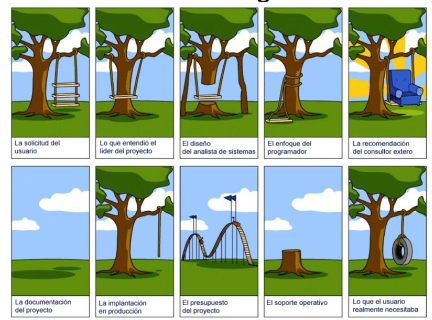

# Metodologías para el desarrollo de software

#### Disciplinas del desarrollo (operativas)
- Captura de requisitod: qué necesita el cliente
- Análisis: qué vamos a construir
- Diseño: cómo
- Construirlo
- Pruebas
- Despliegue
#### Disciplinas de desarrollo (soporte)
- Administracion del proyecto, incluyendo seguimiento y control de tiempos y costos
- Gestion de cambios
- Administracion de la configuración
- Gestion de recursos humanos
- Gestion de riesgos
- Gestion del proceso

## Metodología
Define quién debe hacer qué, cuándo y cómo se deben realizar las distintas tareas.  

### Lineal
Proyecto -> serie de pasos que implican habilidades distintas

`Cascada`: Se sigue este orden y no se puede volver atras.
Requisitos -> Diseño  -> Implementacion -> Verificacion -> Mantenimiento

### Incremental
- Se llega a una solucion cada vez más refinada o que incluya mas caracteristicas.
- Se puede partir de una visión aproximada
- No se conocen de entrada los requerimientos, las tecnologias ni las necesidades tecnológicas que cubren los requerimientos.

## Manifiesto ágil

Individuos e interacciones | Procesos y herramientas
Software funcionando | Documentacion extensiva
Colaboracion con el cliente | Negociación contractual 
Respuesta ante el cambio | Seguir un plan  

Aunque valoramos los elementos de la derecha, valoramos más los de la izquierda.

### Agilismo (caracteristicas)
- Maleable: No impedir los cambios
- Particionable: desarrollar en forma incremental
- Extensible: pensar en evolución permanente
- Interaccion colaborativa
### Agilismo (equipos)
- Potenciar capacidades sociales: mejor trabajar juntos que trabajar separados y unir las partes.
- Comunicación: favorecerla con reuniones.
- Autoorganización en equipos
- Retrospectivas frecuentes, reflexionar sobre los errores